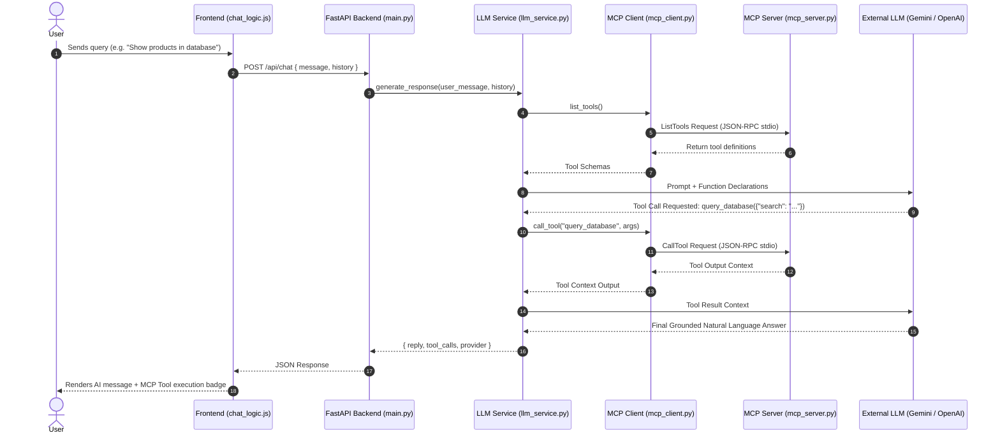

# Modular MCP Agentic Chat Application

A modular, full-stack chat application interfacing an external Large Language Model (LLM) with the **Model Context Protocol (MCP)** to grant the agent live access to external tools and data context (such as time/dates, SQLite database records, safe mathematical computation, and local file reading).

---

## Architecture Overview

This project separates concerns into a modular Python FastAPI backend, an MCP client/server subsystem, and an HTML5 + Tailwind CSS frontend.

```
project-root/
├── backend/
│   ├── main.py             # FastAPI REST endpoints, CORS, request validation
│   ├── llm_service.py      # LLM orchestration, function calling & tool-result loop
│   ├── mcp_client.py       # MCP Client session management (stdio transport)
│   ├── mcp_server.py       # MCP Server exposing tools (Time, DB, Math, Files)
│   ├── requirements.txt    # Python dependencies
│   ├── test_api.py         # Automated pytest test suite
│   ├── .env.example        # Environment variable template
│   └── .env                # Environment configuration (gitignored)
├── frontend/
│   ├── index.html          # Semantic chat interface layout
│   ├── css/
│   │   └── styles.css      # Custom styling, markdown rendering, tool call badges
│   └── js/
│       └── chat_logic.js   # Asynchronous fetch client & state management
├── .gitignore
└── README.md
```

### System Flow


---

## Features

- **Model Context Protocol (MCP) Integration**: Communicates via standard JSON-RPC stdio transport using the official `mcp` SDK.
- **Dynamic Tool Calling**: Seamlessly translates MCP tool schemas into function definitions for external LLMs (Google Gemini & OpenAI).
- **Graceful Error Handling & Fallbacks**:
  - Automatically handles MCP server timeouts and connection errors.
  - If no external API key is provided, falls back to a local agentic reasoning engine that still queries real MCP tools.
- **Modular Frontend**:
  - Distinct separation of Markup (`index.html`), Styles (`css/styles.css`), and Logic (`js/chat_logic.js`).
  - Tailwind CSS responsive design with fixed header, scrollable chat area, and sticky input.
  - Live MCP status pill and active tools modal.
  - Visual badges showing executed MCP tool calls and arguments.
- **Automated Test Suite**: Full `pytest` integration covering API endpoints, tool discovery, and tool execution.

---

## Getting Started

### 1. Prerequisites
- **Python 3.10+** (Python 3.12 recommended)
- `pip` or `uv` package manager

### 2. Environment Setup

Clone the repository and navigate to the project root:

```bash
cd project-root
```

Create and activate a virtual environment:

```bash
# On Linux / macOS:
python3 -m venv backend/.venv
source backend/.venv/bin/activate

# On Windows (PowerShell):
python -m venv backend\.venv
.\backend\.venv\Scripts\Activate.ps1
```

Install backend dependencies:

```bash
pip install -r backend/requirements.txt
```

### 3. Configure Environment Variables

Copy `.env.example` to `backend/.env`:

```bash
cp backend/.env.example backend/.env
```

Edit `backend/.env` to configure your preferred settings:

```ini
# Server Configuration
HOST=127.0.0.1
PORT=8000

# LLM Provider: "gemini", "openai", or "mock" (auto-fallback if no key)
LLM_PROVIDER=gemini

# Google Gemini API (Recommended)
# Obtain a free key at: https://aistudio.google.com/app/apikey
GEMINI_API_KEY=your_gemini_api_key_here
GEMINI_MODEL=gemini-1.5-flash

# OpenAI API (Alternative)
OPENAI_API_KEY=your_openai_api_key_here
OPENAI_MODEL=gpt-4o-mini

# MCP Configuration
MCP_TIMEOUT_SECONDS=10
```

---

## Running the Application

### Option A: Starting the Backend API

Run the FastAPI server from the project root:

```bash
# Using uvicorn directly
python -m uvicorn backend.main:app --host 127.0.0.1 --port 8000 --reload
```

The server will automatically:
1. Initialize the sample SQLite database (`context_database.sqlite`).
2. Establish the stdio MCP connection manager.
3. Expose interactive API docs at `http://127.0.0.1:8000/docs`.

### Option B: Serving the Frontend

You can access the frontend in any of the following ways:

1. **Directly via the FastAPI server**:
   Open [http://127.0.0.1:8000](http://127.0.0.1:8000) in your web browser.

2. **Using Python's built-in HTTP server**:
   ```bash
   python -m http.server 3000 --directory frontend
   ```
   Then navigate to `http://127.0.0.1:3000`.

3. **Directly opening the file**:
   Double click or open `frontend/index.html` in your browser.

---

## MCP Tools Implemented

The MCP Server (`backend/mcp_server.py`) provides the following tools:

| Tool Name | Parameters | Description |
|---|---|---|
| `get_current_time` | `timezone` (str) | Returns the current date, time, and day of the week in UTC or specified timezone. |
| `query_database` | `table` (str), `search` (str) | Queries the local SQLite database for product catalogs, stock, or system service statuses. |
| `calculate_math` | `expression` (str) | Safely computes complex mathematical expressions using an AST evaluator. |
| `read_local_file` | `file_path` (str) | Reads local project documentation or files within the project root for context. |

---

## Example Prompts to Test

Try entering these prompts in the chat UI to observe MCP tool execution in real time:

- **Time Query**: `"What is the current time and date?"`
  *(Invokes `get_current_time`)*
- **Database Query**: `"Search the product catalog for Quantum and list prices and stock"`
  *(Invokes `query_database` with `table="products", search="Quantum"`)*
- **System Health**: `"Check the current system status and uptime"`
  *(Invokes `query_database` with `table="system_status"`)*
- **Math Computation**: `"Calculate 450 * 1.18 + 75"`
  *(Invokes `calculate_math` with `expression="450 * 1.18 + 75"`)*
- **Local File Reading**: `"Read the backend/requirements.txt file and list dependencies"`
  *(Invokes `read_local_file` with `file_path="backend/requirements.txt"`)*

---

## Running Automated Tests

Run the automated `pytest` test suite:

```bash
pytest backend/test_api.py -v
```

Output:
```
backend/test_api.py::test_health_endpoint PASSED                         [ 16%]
backend/test_api.py::test_tools_endpoint PASSED                          [ 33%]
backend/test_api.py::test_chat_endpoint_time_tool PASSED                 [ 50%]
backend/test_api.py::test_chat_endpoint_math_tool PASSED                 [ 66%]
backend/test_api.py::test_chat_endpoint_db_tool PASSED                   [ 83%]
backend/test_api.py::test_chat_endpoint_empty_message PASSED             [100%]

============================== 6 passed in 14.30s ==============================
```

---

## Edge Case Handling

1. **MCP Server Timeout / Downtime**:
   The client wraps every MCP session in an async timeout handler (`MCP_TIMEOUT_SECONDS`). If the server hangs or crashes, the backend gracefully catches the error and generates a fallback response rather than returning an unhandled 500 error.
2. **Missing API Keys**:
   If no `GEMINI_API_KEY` or `OPENAI_API_KEY` is present in `.env`, the system automatically activates its local agentic routing engine to still execute real MCP tools and synthesize responses.
3. **Directory Traversal Prevention**:
   The `read_local_file` MCP tool checks that requested paths reside strictly within the project root.
